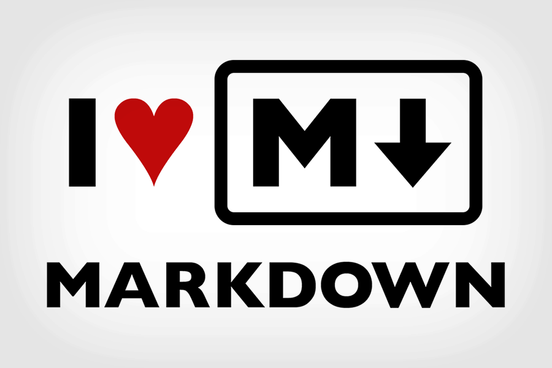

Основные команды Git 1-семинара

[Шпаргалка №1 по markdown по ссылке](http://konvut.github.io/k50articles/)

[Шпаргалка №2 по markdown по ссылке](https://learn.microsoft.com/ru-ru/contribute/markdown-reference)

**git init** – инициализация локального репозитория

*git status* – получить информацию от git о его текущем состоянии

~~git add~~ – добавить файл или файлы к следующему коммиту

> + **git commit -m** *“message”* – создание коммита

> + **git log** – вывод на экран истории всех коммитов с их хеш-кодами

> + **git log --oneline** выводит каждый коммит в одну строку. Это удобно, если вы просматриваете большое количество коммитов

> 1. **git checkout** – переход от одного коммита к другому

> 2. **git checkout master** – вернуться к актуальному состоянию и продолжить работу

> 3. **git diff** –увидеть разницу между текущим файлом и закоммиченным файлом

## Основные команды Git 2-го семинара

> **git checkout  -b** *<название ветки>* - создание ветки и переход к ней

>**git merge --abort** - отменить слияние, которое прошло с конфликтом

>**git log --graph** - вывод на экран истории всех коммитов с их хеш-кодами в древовидной форме

>**git commit -am** *“message”* – добавление файлов в отслеживание и       создание коммита.

>**git log --oneline** – коротенький журнал

> **git branch** – посмотреть список веток в репозитории

> **git branch** *<название ветки>* – создать новую ветку

> **git checkout** *<название ветки>* – переход к другой ветке

>**git checkout -b** *<название ветки>* - создание ветки и переход к ней

**Основные команды 3-го семинара**

+ **git clone** *<url-адрес репозитория>* – клонирование внешнего репозитория на  локальный ПК

+ **git pull** – получение изменений и слияние с локальной версией

